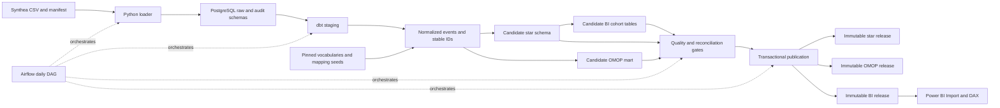
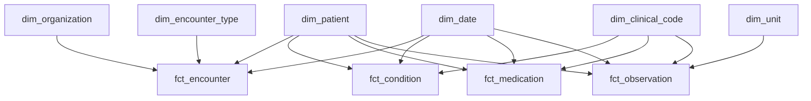
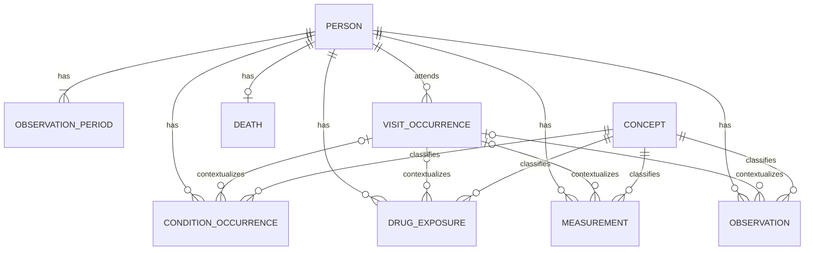
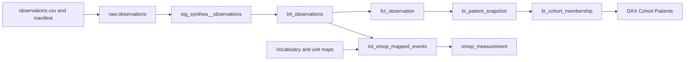

# CohortWarehouse — Product Requirements Document

**Version:** 1.0 · **Date:** September 15, 2026 · **Owner:** Solo analytics engineer  
**Delivery window:** 5–6 weeks, approximately 175 focused hours including learning and contingency  
**Status:** Implementation specification; performance numbers below are acceptance targets, not measured results.

## 1. Overview & Problem

Clinical and research analysts need to identify patient populations, understand the evidence behind membership, and trust that repeated pipeline runs produce consistent results. Raw EHR exports make this difficult: events have different grains, terminology varies, and joining diagnoses, visits, and medications can multiply rows and inflate counts.

CohortWarehouse will turn **Synthea-generated synthetic CSV exports** into two complementary analytical products:

1. A **Kimball star schema**: event tables, called facts, connected to descriptive tables, called dimensions, for understandable and performant BI.
2. An **OMOP Common Data Model mart**: a defined subset of standardized clinical tables and vocabulary mappings for research-oriented querying and comparison.

The pipeline will ingest data, transform it with dbt, run quality gates, publish a consistent release, and expose cohort-discovery reports. Apache Airflow will schedule and monitor the warehouse workflow. A hiring reviewer must be able to inspect the code, reproduce the pipeline, and trace a displayed count back to source records.

### Selected implementation

| Layer | Required choice | Reason and boundary |
|---|---|---|
| Source | Pinned Synthea release/commit; CSV export | Keep generation reproducible and parsing accessible. No FHIR parser in the MVP. |
| Warehouse | PostgreSQL 16, with a pinned patch/container digest | Builds on the engineer's existing SQL skills; one database engine to operate and test. |
| Transformations | dbt Core with `dbt-postgres` | SQL models, dependency management, testing, and generated documentation. |
| Orchestration | Pinned Airflow 3.x with its matching providers and constraints | One DAG, local development deployment, no Kubernetes or Celery requirement. |
| Runtime | Docker Compose on Linux; Windows host uses WSL2/Docker Desktop | Airflow runs in Linux containers. Power BI Desktop runs on Windows. |
| BI | Power BI Desktop, Import mode; DAX measures | Local `.pbix` deliverable. Desktop refresh is an explicit manual step. |
| CI | GitHub Actions with a disposable PostgreSQL service | Fast automated checks without a paid warehouse. |

Pin exact compatible tool versions during the week-one smoke test in a lockfile and image manifest; do not use floating `latest` tags. Run dbt in an isolated virtual environment within the task runtime so Airflow and dbt dependency constraints do not conflict.

DuckDB, Snowflake, and Tableau are **alternative implementations**, not additional deliverables. Supporting two warehouses or two BI tools would consume the learning buffer. Cloud hosting and Power BI Service refresh are later extensions, subject to the account's capabilities. Microsoft documents separate service licensing and refresh requirements. [Power BI licensing](https://learn.microsoft.com/en-us/power-bi/fundamentals/service-features-license-type), [refreshing models from local Desktop files](https://learn.microsoft.com/en-us/power-bi/connect-data/refresh-desktop-file-local-drive).

### Dataset contract

- **Development fixture:** 25 synthetic people, hand-checked edge cases, and three ordered batch manifests.
- **Release benchmark:** request 1,000 Synthea patients with a fixed seed, location, generator configuration, and simulation end date. Record the actual generated patient count, which need not equal the requested population exactly.
- **Reference machine:** 4 available CPU cores, 16 GB system RAM, SSD, at least 8 GB allocated to containers, and 30 GB free working space. Record actual hardware and resource limits with results.
- **Scale exercise, P1:** 10,000 generated patients or at least 1 million supported event rows. Do not extrapolate throughput without measuring it.
- Record observed row counts instead of inventing a guaranteed number of events per patient. The official source contract is the [Synthea CSV data dictionary](https://github.com/synthetichealth/synthea/wiki/CSV-File-Data-Dictionary).

## 2. Goals & Non-Goals

**Priority vocabulary:** P0 = required for completion; P1 = optional after every P0 gate passes; P2 = future work.

### Goals

| ID | Goal | Completion evidence |
|---|---|---|
| G-01 | Produce reproducible ingestion and both analytical marts | A clean environment builds the fixture and benchmark using documented commands. |
| G-02 | Make cohort counts understandable and correct | All three cohort templates match independent SQL and expected fixture memberships exactly. |
| G-03 | Demonstrate reliable operations | Replay, correction, late-arrival, deletion, and failed-publication drills pass. |
| G-04 | Demonstrate research interoperability honestly | Scoped OMOP 5.4 tables pass declared structural and mapping checks; unsupported domains are disclosed. |
| G-05 | Make ownership and lineage inspectable | Every published model has a grain, owner, description, tests, and source lineage. |
| G-06 | Demonstrate appropriate governance habits | Synthetic provenance, access restrictions, secret handling, licensing records, and retention are verifiable. |

### Non-goals

- Production clinical decision support, diagnosis, validated phenotyping, treatment recommendations, causal inference, or clinical trial recruitment.
- Real patient data, real student records, PHI de-identification services, institutional compliance certification, or production security accreditation.
- A complete OMOP implementation, OHDSI network-study readiness, full Achilles/ATLAS deployment, or every DataQualityDashboard check.
- Streaming, source-system CDC, FHIR/HL7 integration, distributed compute, high availability, patient identity matching, and multiple source organizations with overlapping patient identities.
- Claims adjudication, revenue-cycle accuracy, medication adherence inference, or clinically validated population prevalence.
- A custom web application, arbitrary cohort-expression editor, automated local Power BI Desktop refresh, or mandatory cloud deployment.

## 3. Personas

| Persona | Goal | Evaluation lens | Required evidence |
|---|---|---|---|
| Data engineering hiring manager | Assess whether a new graduate can build, explain, and maintain a coherent analytics system | SQL quality, grain selection, key stability, incremental behavior, failure recovery, tradeoffs, reproducibility | Ten-minute demo; readable dbt models; CI results; failed-run recovery; benchmark report; short architecture decisions |
| Clinical/research data analyst | Find a synthetic population and understand why patients qualify | Correct unique-person counts, clear time windows, filter behavior, readable terminology, missing-data visibility, usable performance | Three cohort templates; cohort definition panel; demographic breakdown; evidence drill-through; SQL reconciliation |
| Data governance/compliance reviewer | Determine provenance, permitted use, access, and traceability | Synthetic-only boundary, least privilege, sensitive-field handling, vocabulary licenses, lineage, retention, unsupported uses | Data inventory; provenance manifest; access matrix; role-denial tests; mapping log; release history; limitations statement |

The solo engineer may perform documented acceptance walkthroughs using these personas. Simulated review must not be represented as actual clinician, privacy-office, or hiring-manager approval.

## 4. User Stories

| ID | Story | Acceptance criteria |
|---|---|---|
| US-01 | As a hiring manager, I can reproduce the project | From documented prerequisites, the 25-person fixture reaches a passing warehouse release in at most 30 minutes, excluding downloads. |
| US-02 | As an analyst, I can identify adults with a recorded hypertension diagnosis | C1 displays the definition version and as-of date; its distinct membership matches the fixture and SQL reference exactly. |
| US-03 | As an analyst, I can narrow that group using a recent measurement | C2 uses the latest eligible systolic measurement per person; missing/invalid units never become a zero result. |
| US-04 | As an analyst, I can inspect utilization | C3 counts distinct encounter IDs and excludes visits outside its stated window. |
| US-05 | As an analyst, I can inspect why a synthetic person qualified | Drill-through shows a pseudonymous key, evidence dates, source code, mapped concept where available, and membership rule. |
| US-06 | As a reviewer, I can trace a result | A selected event can be traced through BI, star or OMOP, intermediate model, staging, and immutable source batch. |
| US-07 | As the operator, I can rerun a failed load | Retry does not duplicate events or change existing person keys; consumers retain the previous validated release until publication succeeds. |
| US-08 | As a governance reviewer, I can verify access boundaries | The BI role cannot read raw/staging tables or change published data; the OMOP reader cannot read raw identifiers. |

## 5. Functional Requirements

### 5.1 Generation and ingestion

| ID | P0 requirement | Acceptance test |
|---|---|---|
| ING-01 | Generate CSVs into an isolated batch directory; record generator version, seed, arguments, configuration hash, end date, file hashes, and counts | Reusing the pinned configuration reproduces clinical content after excluding documented volatile exporter metadata. |
| ING-02 | Require `patients`, `encounters`, `conditions`, `medications`, `observations`, and `organizations` CSV files | Missing files fail preflight. Header-only files are valid when the manifest declares zero records. |
| ING-03 | Validate headers and required types against a versioned source contract | Missing/renamed required columns fail the batch. Extra columns are recorded and ignored until explicitly modeled. |
| ING-04 | Stream files through PostgreSQL `COPY` into a raw schema, retaining original clinical values as text | Loader handles quoted delimiters, blank values, Unicode, and malformed-row fixtures without silently shifting columns. |
| ING-05 | Attach `dataset_id`, `batch_id`, file hash, row number, ingestion timestamp, and source-row fingerprint | Every accepted or quarantined row has a resolvable source locator. |
| ING-06 | Maintain file, batch, and row reconciliation records | For each file: parsed records = accepted records + quarantined records; physical CSV line counts are not used as record counts. |
| ING-07 | Reject non-synthetic inputs by workflow contract | A batch without the approved generator provenance and `synthetic=true` declaration fails before loading. This declaration is not a PHI detector. |

Raw imports are transactional per batch: a failure cannot leave a batch marked complete with missing files. File hashes provide ingestion idempotency; transformation versions remain independently rerunnable.

### 5.2 Staging and transformation

- **STG-01:** Create one staging model per required CSV; normalize names to `snake_case`, preserve identifiers/codes as text, parse dates and numeric values, and normalize timestamped events to UTC. Date-only fields remain dates.
- **STG-02:** Distinguish missing, invalid, and zero values. Invalid required IDs/dates enter quarantine; an unknown code remains an accepted event with an unmapped status.
- **STG-03:** Validate patient references before publishing facts. A missing optional organization becomes the star's Unknown organization; an absent optional visit link becomes null in OMOP. A supplied visit referencing another person is a blocking error.
- **STG-04:** Never treat repeated diagnoses or same-day measurements as duplicates solely because patient, date, and code match. Preserve multiplicity under the event-key policy in Section 8.
- **STG-05:** Capture every exclusion with source event, destination, reason, model version, and batch. No unexplained record loss is permitted.

### 5.3 Analytical models

- **MOD-01:** Build four star facts and the shared dimensions specified in Section 8; each model must declare one grain.
- **MOD-02:** Build the scoped OMOP tables and a source-to-OMOP event crosswalk without custom columns inside official CDM tables.
- **MOD-03:** Derive both marts from shared normalized events and mapping inputs. Do not derive OMOP by reverse-engineering a BI aggregate.
- **MOD-04:** Publish both marts and BI tables under one release ID only after all P0 quality gates pass.
- **MOD-05:** Apply changed-person processing for event tables. Rebuild small dimensions and cohort summaries as necessary; measure this work as part of incremental runtime.

### 5.4 Cohort definitions

Store definitions and code sets in version-controlled YAML/CSV. MVP cohort logic is fixed and inspectable; demographic slicers operate on the resulting memberships. Changing a clinical threshold or time window requires updating the definition and rebuilding.

**Common semantics:** `D` is the manifest's simulation as-of date, not today's system date. Include people aged at least 18 on D, using completed years, who are alive on D and have at least one encounter starting in the inclusive window `[D - 364 days, D]`. A death date on D means the person is not alive at the end of D. The eligible population is the common denominator. Use UTC dates for timestamp boundaries.

| Template | Membership rule | Required boundary tests |
|---|---|---|
| C1: Recorded hypertension | Eligible person with a condition in the explicit hypertension source-code set, starting on/before D; null stop or stop on/after D | Birthday on D; resolved condition; duplicate diagnosis; condition starting after D |
| C2: Recorded hypertension with systolic value above the demo threshold | C1 plus latest numeric systolic measurement in `[D - 89 days, D]`, canonical unit `mm[Hg]`, value strictly greater than 140 | Exactly 140 excluded; older high value followed by lower value excluded; missing numeric value excluded; wrong unit excluded |
| C3: Frequent recorded encounters | Eligible person with at least three distinct encounter IDs starting in `[D - 364 days, D]` | Two versus three visits; repeated condition joins; visit exactly on each boundary |

Start the hypertension source set with SNOMED codes `59621000` and `38341003`, and systolic measurement with LOINC `8480-6`; validate their presence and mappings against the pinned dataset and vocabulary. The set is explicitly limited, with no implied descendant expansion. Synthea's own modules supply these examples. [Hypertension module](https://raw.githubusercontent.com/synthetichealth/synthea/master/src/main/resources/modules/hypertension.json), [wellness encounter module](https://github.com/synthetichealth/synthea/blob/master/src/main/resources/modules/wellness_encounters.json).

For tied measurement timestamps, choose the greatest stable event key as a deterministic tie-breaker and expose a tie flag. Never select the maximum value as a substitute for the latest value. Thresholds and code sets demonstrate engineering behavior; they are not validated clinical phenotypes.

### 5.5 Dashboard requirements

| Page | Required content | Acceptance criteria |
|---|---|---|
| Cohort discovery | Single-select cohort; count; eligible population; percent of eligible population; age-band, recorded-sex, race, ethnicity slicers; definition panel | All cards and demographic charts honor the same filters. Percent uses the same demographic denominator. Empty results show zero count and an informative state. |
| Cohort evidence and utilization | Membership reasons; latest qualifying measurement; distinct encounter totals; monthly encounter trend; synthetic-person drill-through | No patient names, full addresses, or government identifiers. Evidence matches source events and time windows. |
| Data trust | Release ID; source as-of date; warehouse publication time; BI import time; mapping coverage; rejected rows; quality results | All times have labels/time zones. A failed warehouse run leaves the prior release visible. |

Additional requirements:

- **BI-01:** Provide at least six explicit DAX measures; hide technical keys from report authors' default field view.
- **BI-02:** Show counts of missing measurement values and unmapped codes. Distinguish no recorded evidence from evidence of absence.
- **BI-03:** Export only aggregate cohort results by default; include definition version and release ID in the export or its accompanying metadata.
- **BI-04:** Give visuals readable labels, keyboard navigation, sufficient contrast, and no color-only status encoding.
- **BI-05:** Supply the `.pbix`, a measure-definition text file, screenshots, a relationship diagram, and a refresh runbook. No service subscription is required for acceptance.

## 6. Non-Functional Requirements

| ID | Requirement and target | Measurement/acceptance |
|---|---|---|
| NFR-01 | Full benchmark load through publication completes within 20 minutes | Three measured runs on the reference environment; excludes generation, image downloads, vocabulary download/import, and BI import; includes transformations, tests, and publication. |
| NFR-02 | A batch changing 5% of benchmark patients completes within 5 minutes | Fixture includes inserts, corrections, and removals; report scanned versus rewritten rows and time by stage. |
| NFR-03 | Identical input and code are idempotent | Two replays have identical clinical row multisets, cohort memberships, and existing surrogate keys; audit timestamps/run IDs may differ. |
| NFR-04 | Daily warehouse delivery deadline is 06:00 UTC | Complete manifest available by 05:00 UTC; DAG begins at 05:15 UTC; 10 consecutive scheduled test runs meet deadline while the host is available. |
| NFR-05 | Freshness is measured independently from event recency | `now - latest_successful_source_delivery` warns after 26 hours and fails the freshness check after 48 hours in scheduled mode. Frozen-demo mode is labeled and assessed against its declared delivery schedule. |
| NFR-06 | BI freshness has an explicit local refresh boundary | During the acceptance demo, operator initiates Desktop refresh within 15 minutes of publication; import finishes within 2 minutes. The UI shows the imported release. No unattended Desktop refresh SLA is claimed. |
| NFR-07 | Interactive performance is usable | p95 visual update <=2 seconds and page load <=5 seconds over 30 scripted interactions after import; record first-load separately. |
| NFR-08 | SQL cohort queries perform predictably | p95 <=2 seconds across at least 20 runs per reference query; report warm-cache results and first run separately using PostgreSQL execution plans. |
| NFR-09 | Publication is consistent | Readers see a fully committed release; injected errors during publication leave every published table and release ID unchanged. BI refresh verifies one release across its queries. |
| NFR-10 | Recovery is reproducible | Restore the previous publication within 15 minutes after an injected bad release; document commands, retained artifacts, and measured recovery. |
| NFR-11 | Credentials and privileges are bounded | No credentials in Git/log fixtures; connection values use environment/secret configuration; negative access tests pass. |
| NFR-12 | Local operation needs no paid data service | All P0 acceptance work runs locally; document installed software terms and actual costs instead of assuming institutional licensing is free. |

The laptop's availability is a dependency of the demo SLA. The system must record missed deliveries and failed runs rather than claiming continuous service while the host is asleep. Synthea simulation dates do not indicate operational delivery freshness.

## 7. Architecture & Diagrams

### System architecture



**Schema boundaries:** `raw` stores immutable batches; `stg`/`int` expose a selected input revision; `work_star`, `work_omop`, and `work_bi` contain private candidates; `ops` contains manifests, key registries, crosswalks, errors, and releases. Airflow has a separate metadata database and role. BI cannot read working schemas.

Published physical schemas are `star_rNN`, `omop_rNN`, and `bi_rNN`. Stable `star`, `omop`, and `bi` views point to the current release. Power BI imports from one immutable `bi_rNN`, selected through a report parameter, so separate import queries cannot mix releases.

### Star schema



Arrows represent dimension-to-fact one-to-many relationships. Facts share dimensions; BI does not directly relate facts to other facts. Clinical facts retain encounter keys for SQL evidence tracing. Event-start dates are the active date relationships; end-date analysis uses a separately named date role.

### OMOP entity relationships



Repeated vocabulary references are omitted for readability. The generated physical ER diagram must show all implemented keys and optionality. People without valid supported events remain in the star but enter an exclusion ledger for this project's OMOP person population, ensuring each included person has an observation period.

### Lineage example and documentation gate



- **DOC-01:** Commit Mermaid sources, rendered architecture/star images, and a generated physical ER diagram.
- **DOC-02:** Generate dbt docs with `manifest.json`, `catalog.json`, and `run_results.json`; add a dbt exposure linking the Power BI report to upstream models.
- **DOC-03:** Link diagrams and a static docs artifact from the README.
- **DOC-04:** Trace three events through each applicable mart and BI to their source locators and release IDs. Public documentation must exclude restricted raw previews.

## 8. Data Model (Star + OMOP)

### 8.1 Source-to-target mapping

Check exact headers against the pinned exporter. Before implementing each target, commit a field-level mapping CSV containing source file/column, target table/column, SQL expression, type, null/default policy, key role, vocabularies, routing rule, rationale, owner, requirement ID, and test ID.

| Source | Principal fields | Star target | OMOP destination |
|---|---|---|---|
| `patients.csv` | ID, birth/death dates, recorded sex/gender, race, ethnicity, state | `dim_patient` | `PERSON`, `DEATH` |
| `encounters.csv` | ID, patient, start/stop, encounter class, organization, recorded costs | `fct_encounter`, encounter-type dimension | `VISIT_OCCURRENCE` |
| `conditions.csv` | Patient, encounter, start/stop, system/code | `fct_condition`, clinical-code dimension | `CONDITION_OCCURRENCE`; mapped-domain exceptions follow routing rules |
| `medications.csv` | Patient, encounter, start/stop, code, dispenses, recorded costs | `fct_medication`, clinical-code dimension | `DRUG_EXPOSURE` |
| `observations.csv` | Patient, encounter, date, code, value, units, type | `fct_observation`, code/unit dimensions | `MEASUREMENT` or `OBSERVATION`, according to target domain |
| `organizations.csv` | ID, organization label, city/state | `dim_organization` | `CARE_SITE` is P1; MVP optional care-site references remain null |
| Supported clinical event boundaries | Person, earliest/latest supported event | First/last recorded event attributes | `OBSERVATION_PERIOD` |
| Approved vocabulary package | Concepts, relationships, metadata | Mapping references; source labels remain separate | Vocabulary/support tables and `CDM_SOURCE` |

Unmodeled files remain in the source directory and are listed as excluded from P0 ingestion. P1 mappings: procedures → `PROCEDURE_OCCURRENCE`, providers → `PROVIDER`, organizations → `CARE_SITE`, immunizations → appropriate drug records. Payers, claims, devices, imaging, and notes are P2. Source accounting identifies these scope exclusions.

Fields absent from Synthea receive a CDM-permitted null or documented default, never fabricated clinical detail.

### 8.2 Star facts

| Fact | Exact grain / primary key | References | Measures and attributes |
|---|---|---|---|
| `fct_encounter` | One source encounter / `encounter_key` | Patient, start/end date, organization, encounter type | Start/end timestamps, duration minutes, source encounter ID, count = 1, separately named source base cost and total claim cost |
| `fct_condition` | One preserved source condition occurrence / `condition_key` | Patient, start/end date, clinical code; nullable encounter key for tracing | Start/end dates, source-event key, count = 1 |
| `fct_medication` | One source medication row / `medication_key` | Patient, start/end date, clinical code; nullable encounter key | Source dispenses/costs when present, source-event key, count = 1 |
| `fct_observation` | One source observation row, including repeated same-time values / `observation_key` | Patient, observation date, clinical code, unit; nullable encounter key | Numeric value and/or original text, source type, parse status, source-event key, count = 1 |

Do not sum measurements across tests or units. Do not add encounter base cost to total claim cost and call it total cost. Source costs are synthetic attributes, not validated accounting amounts. Distinct patients and encounters are computed from their stable keys; event counts are not patient counts.

### 8.3 Dimensions and slowly changing data

| Dimension | Natural key / surrogate key | Required attributes | Change policy |
|---|---|---|---|
| `dim_patient` | Dataset + patient UUID / integer patient key | Birth date in protected analytical layer, recorded demographics, state, death date, first/last event | Type 1: corrections overwrite attributes; key remains stable |
| `dim_date` | Date / integer `YYYYMMDD` | Date, year, quarter, month, week, day | Type 0: immutable; extend through all event dates and D |
| `dim_organization` | Dataset + organization UUID / integer key | Label, city, state | Type 1 |
| `dim_encounter_type` | Normalized class / integer key | Source class, reporting label/group | Type 1; versioned seed |
| `dim_clinical_code` | Source vocabulary + code / integer key | Source description/category, mapping status | Type 1; retain mapping version in lineage |
| `dim_unit` | Normalized unit string / integer key | Source/canonical label, mapped unit concept where available | Type 1; versioned policy |

**SCD handling:** Type 1 uses the latest supplied descriptive value in the current release; it does not reconstruct demographics or geography at a historical event date. Older immutable releases retain their original dimensions.

P1 may add a dbt snapshot of patient geography with `valid_from`, `valid_to`, and `is_current` to demonstrate Type 2. These dates describe when the warehouse observed a change. Historical facts must not be assigned an earlier residence without source-effective dates and a documented temporal rule. Type 2 is not needed to satisfy P0.

### 8.4 Surrogate keys, event identity, and unknowns

1. Persist `ops.entity_key_map(entity_type, dataset_id, natural_key, surrogate_id)`, unique on the natural-key tuple and assigned ID. Allocate PostgreSQL integer sequence values; never truncate UUIDs or use rebuild-dependent row numbering for OMOP IDs.
2. Reuse patient and encounter IDs across star and OMOP for overlapping populations. Serialize assignments transactionally. Sequence gaps are harmless.
3. For tables without native event IDs, use a SHA-256 fingerprint of canonical source clinical fields plus an occurrence ordinal for identical rows. Exclude file order, batch ID, ingestion time, and other load metadata. Preserve identical-row multiplicity.
4. Specify field order, encoding, null markers, and escaping in canonical serialization. Compare canonical content when a fingerprint is reused to detect a collision.
5. Unchanged rows retain IDs across snapshots. A correction to a keyless row removes its former identity and inserts a new one; record that limitation rather than implying a durable source ID exists.
6. For mapping fan-out, allocate target IDs using source-event key, destination table, target concept, and mapping ordinal. A mapping revision may change target event IDs; it must not change person IDs.
7. Reserve star key `0` for permitted Unknown dimension references. Orphan events cannot be assigned an Unknown patient to bypass tests. OMOP concept `0` means unmapped where applicable; optional absent entity references are null, not person/visit ID `0`.
8. Preserve the key registry across full refreshes and back it up with releases. Rebuilding without it must reproduce clinical content and memberships by source keys; identical numeric IDs require registry restoration.

### 8.5 OMOP profile

Target **OMOP CDM 5.4**, using pinned official PostgreSQL DDL and required field definitions for implemented tables. The full DDL may create empty tables, but `docs/omop-scope.md` must distinguish structural presence from populated/tested functionality. Keep custom audit fields in `ops`, not inside CDM tables. [OMOP 5.4 specification](https://ohdsi.github.io/CommonDataModel/cdm54.html).

| P0 table/group | Project ETL rule | Verification |
|---|---|---|
| `PERSON` | Stable person ID, birth components, explicit demographic mappings | Required fields and references; reconcile excluded no-event people |
| `OBSERVATION_PERIOD` | One inferred span: earliest supported event to latest supported boundary, clipped to D and known death date | Valid order; one span/person; disclose that inferred span does not establish continuous coverage |
| `VISIT_OCCURRENCE` | One source encounter per visit; reviewed encounter-class mapping; supplied dates | Required end date uses start when stop is absent; externally record imputation |
| `CONDITION_OCCURRENCE` | Mapped events with retained source codes and supplied dates | Correct target domain; no invented certainty/severity |
| `DRUG_EXPOSURE` | One source medication record; supplied start/stop; missing required end uses start as documented conservative convention | Expose imputation; do not infer adherence, administration, days supply, route, dose, or individual fills |
| `MEASUREMENT` | Measurement-domain events with numeric or coded values | Unit/value consistency; no coercion of text into zero |
| `OBSERVATION` | Observation-domain events with appropriate numeric/text/coded values | Correct domain and permitted source-value fields |
| `DEATH` | One supplied death date on/before D; no invented cause | At most one/person; not before birth |
| Vocabulary/support | `CONCEPT`, `VOCABULARY`, `DOMAIN`, `CONCEPT_CLASS`, `RELATIONSHIP`, `CONCEPT_RELATIONSHIP`, `CDM_SOURCE` | Version consistency, referenced records, source/ETL metadata |

Commit explicit mappings for every required CDM field. Resolve provenance/type concept IDs from the pinned vocabulary, record their numeric IDs and meanings in seeds, and validate them. A clinical concept cannot stand in for a provenance concept. `CDM_SOURCE` records source provenance, ETL repository/version, CDM version, vocabulary version, and release date.

P1 includes `CONCEPT_ANCESTOR`, `DRUG_STRENGTH`, derived eras, and descendant-based concept sets. The MVP uses explicit code sets. Downloads must include the concepts and relationship metadata needed for its mappings; vocabulary packages remain outside public Git unless redistribution is permitted. [OHDSI vocabulary distribution guidance](https://github.com/OHDSI/Vocabulary-v5.0/wiki/General-Structure,-Download-and-Use).

### 8.6 Mapping algorithm

- **MAP-01:** Normalize source vocabulary aliases through a seed. Where a system column is absent, use the pinned exporter's documented table-level code system and record the assumption. Match text codes within vocabularies, not by display-name similarity.
- **MAP-02:** Preserve source code and source concept ID. Use a valid standard source concept directly when appropriate; otherwise follow active `Maps to` relationships to valid standard targets in the pinned release.
- **MAP-03:** Route by target domain, independently of input filename or numeric value. Implement Condition, Drug, Measurement, and Observation routes. Other domains enter a routing-exclusion ledger. Expand valid one-to-many mappings with crosswalks. `Maps to value` cases need explicit tests; unsupported cases cannot satisfy cohort rules.
- **MAP-04:** When no mapping exists, preserve the event with concept `0` in a source-appropriate supported table only if its domain is defensible from the source contract. Ambiguous cases enter the exception ledger. Unknown zero is never counted as successful mapping.
- **MAP-05:** Unit normalization uses a versioned whitelist. C2 accepts `mm[Hg]` and explicitly approved equivalents. Other units exclude that value from C2 but do not erase the event. No undocumented conversion.
- **MAP-06:** Report distinct-code and event-weighted coverage by input category and destination domain. Require 100% valid mappings for cohort codes and at least 95% event-weighted coverage separately for in-scope conditions, medications, and measurements. Show excluded and unmapped events beside the percentages.

Coverage numerator is distinct source events with at least one valid, supported standard mapping; denominator is all accepted events in that input category, including mapping/routing exceptions. Fan-out does not inflate coverage. Source files explicitly outside P0 are reported separately.

## 9. Pipeline & Semantic-Layer Design

### 9.1 Repository and dbt interfaces

```text
compose.yml
.env.example
requirements/                  # Locks and container versions
config/                        # Source contract, generator config, SLA mode
ingestion/                     # Manifest validation, COPY, reconciliation
dags/cohortwarehouse_daily.py
dbt/
  models/sources/              # Raw sources and freshness definitions
  models/staging/synthea/      # stg_synthea__*: names and types
  models/intermediate/        # int_*: identities, links, normalized events
  models/marts/star/          # dim_* and fct_*
  models/marts/omop/          # omop_*; CDM table aliases
  models/marts/bi/            # Cohorts, patient snapshot, summaries, status
  macros/                    # Minimal helpers and person-slice replacement
  seeds/                     # Code sets, aliases, visit types, units
  tests/                     # Singular SQL assertions
  snapshots/                 # P1
bi/                          # PBIX, DAX, screenshots
scripts/                     # Bootstrap, run, publish, restore, benchmark
tests/fixtures/              # Tiny synthetic batches and expected results
docs/                        # Mapping, diagrams, runbooks, decisions
.github/workflows/ci.yml
```

Staging renames/types data; intermediate models own identity, encounter linkage, and normalization; star models own reporting grains; OMOP models own CDM contracts; BI models own cohort definitions and aggregates. Use `source()` and `ref()` dependencies, with no hardcoded environment database names.

Staging uses views; small dimensions and BI summaries use rebuilt tables; large person-linked events use incremental tables. An incremental model needs explicit selection/update logic: a configured unique key does not solve deletion and late-arrival handling. [dbt incremental guidance](https://docs.getdbt.com/docs/build/incremental-models).

### 9.2 Incremental protocol

The MVP consumes **authoritative snapshots**, including explicitly scoped patient-subset snapshots, rather than source CDC.

1. A manifest declares dataset, monotonic source revision, batch ID, as-of date, delivery time, hashes, patient scope, and full-versus-scoped replacement mode. All six required files are present, even when empty. Organizations is a complete reference snapshot.
2. Compare per-person fingerprints of the clinical row multiset and patient attributes against the published source state. New, changed, and removed persons enter `ops.changed_person`.
3. Absent rows are removals only within the declared replacement scope. Missing files are errors, not deletions. Retain earlier raw batches.
4. Late events are detected by content regardless of clinical date. Organization changes rebuild that dimension. Changed vocabulary, cohort logic, mapping policy, or historical transformation logic triggers a full affected-model rebuild even with identical source files.
5. Each incremental event model uses a **transactional pre-hook** to delete its changed-person slice, then inserts the complete replacement slice with an append strategy. Include changed people who now have zero rows. Verify that the pinned adapter commits the delete and insert together.
6. Build private candidates only. Retrying the same batch repeats the same slices. An interrupted multi-model run must rerun all affected downstream models before validation.
7. Compare incremental output with an independent full rebuild of the same input revision. Content, mappings, source identities, and memberships must match exactly, excluding documented audit differences.
8. Advance the published revision only during successful publication. Historical revisions can be rebuilt for inspection; restoring one as current uses the explicit restore command.

Scanning source snapshots and rebuilding small summaries is acceptable. Report scanned and rewritten rows separately. Do not generate a new random population daily and describe it as an incremental update to existing patients.

### 9.3 Airflow DAG


- DAG: `cohortwarehouse_daily`; cron `15 5 * * *`; UTC; fixed start date; `catchup=False`; `max_active_runs=1`.
- Resolve expected delivery from the scheduled interval, then pin its manifest ID for all retries. Missing delivery fails promptly.
- Manual parameters: `batch_id`, `full_refresh`, validation-only historical build. Production clinical dates never come from execution-time `now()`.
- Retry transient I/O/DB failures twice, five minutes apart. Configure task timeouts and a 40-minute DAG timeout. Contract/quality failures do not receive blind retries.
- Use one warehouse-write pool slot and a PostgreSQL advisory lock to prevent DAG/CLI races.
- Keep transformations in dbt. Pass only batch IDs, paths, counts, and statuses through XCom.
- Credentials come from environment-backed Airflow Connections, not DAG source or logs.
- Record run ID, Git SHA, source revision, vocabulary version, task timing/counts, failures, and publication ID.
- A failure callback writes an operational alert event and visible log. Email/Slack is P1.
- Failure before publication preserves the prior release. Docs failure after publication is recorded as documentation-incomplete and retried; it does not imply the published data rolled back.

These behaviors follow Airflow's repeatable-task guidance. Compose is a local development deployment. [Airflow best practices](https://airflow.apache.org/docs/apache-airflow/stable/best-practices.html), [Docker setup](https://airflow.apache.org/docs/apache-airflow/stable/howto/docker-compose/index.html).

### 9.4 Publication and recovery

Create immutable release schemas from validated candidates, compare copied counts/checksums, and switch stable views plus `ops.current_release` in one PostgreSQL transaction. Use explicit columns. Block publication if validated metadata does not match candidate input/configuration.

Full copying at publication is an intentional local-scale simplification, included in both runtime budgets. Candidate event processing is incremental; publication copying is not. Retain current/previous successful releases and key-registry backups. Restore by atomically switching pointers/views and rechecking cohort totals.

Power BI imports one immutable release schema. Updating its schema parameter and refreshing completes the local demo. The status table identifies the imported release; Power Query records import time. Keep the previous PBIX until refresh succeeds. Cleanup refuses to remove current, previous, or report-pinned releases.

### 9.5 BI semantic model

| Model | Grain and contents |
|---|---|
| `bi_patient_snapshot` | One eligible patient at D; patient key, age/band at D, demographics, 365-day encounter count, latest valid recent systolic value/date, missing/tie flags |
| `bi_cohort_definition` | One definition version; rule, windows, threshold, code-set version, D |
| `bi_cohort_membership` | One definition/person pair; evidence keys and dates |
| `bi_cohort_month` | One definition/person/encounter-start month; preaggregated distinct encounter count |
| `bi_release_status` | One release; source, publication, mapping, and quality metadata |

Patient snapshot and cohort definition filter membership and monthly tables in one direction. A month/date dimension filters only the monthly table. Patient snapshot remains unaffected by cohort selection and supplies the demographic-filtered denominator. No fact-to-fact or automatic bidirectional relationships. [Microsoft star-schema guidance](https://learn.microsoft.com/en-us/power-bi/guidance/star-schema).

Required DAX examples:

```dax
Eligible Patients =
    COUNTROWS ( bi_patient_snapshot )

Cohort Patients =
    COALESCE (
        DISTINCTCOUNT ( bi_cohort_membership[patient_key] ),
        0
    )

Cohort Share =
    DIVIDE ( [Cohort Patients], [Eligible Patients] )

Cohort Encounters =
    SUM ( bi_cohort_month[encounter_count] )

Mean Age in Cohort =
    VAR Members = VALUES ( bi_cohort_membership[patient_key] )
    RETURN
        CALCULATE (
            AVERAGE ( bi_patient_snapshot[age_at_as_of] ),
            KEEPFILTERS (
                TREATAS ( Members, bi_patient_snapshot[patient_key] )
            )
        )

Cohort Patients Missing Systolic =
    VAR Members = VALUES ( bi_cohort_membership[patient_key] )
    RETURN
        COALESCE (
            CALCULATE (
                COUNTROWS ( bi_patient_snapshot ),
                KEEPFILTERS (
                    TREATAS ( Members, bi_patient_snapshot[patient_key] )
                ),
                bi_patient_snapshot[has_valid_recent_systolic] = FALSE ()
            ),
            0
        )
```

Enforce single-select cohort choice wherever encounter totals are shown, preventing multi-cohort double counting. Month filters affect utilization visuals, not the fixed cohort membership/as-of date. Label this explicitly. Cohort Share is a descriptive percentage of eligible synthetic records, not disease prevalence.

Every measure has a definition, unit, filter contract, and matching SQL check in `docs/metric-contracts.md`. Clinical rules live in tested dbt models; DAX handles aggregation/display.

## 10. Standards & Compliance

### OMOP and governance

- **GOV-01:** Record CDM DDL commit, vocabulary release, source contract, mapping versions, and project release; check implemented column/type contracts.
- **GOV-02:** Maintain populated/tested, empty, and unsupported table categories; call this a scoped OMOP 5.4 mart.
- **GOV-03:** Record vocabulary access/license steps and checksums. Keep restricted downloads outside public Git.
- **GOV-04:** Mapping changes include source/target codes, author/date, rationale, tests, and review status. `not_reviewed` is valid; invented clinical approval is not.
- **GOV-05:** Maintain a data inventory/dictionary, access matrix, lineage, issue register, and definition change log.

### HIPAA and synthetic data

HIPAA applicability depends on the entity and information involved. Generator-produced fictional data does not become PHI merely because it uses EHR fields. This project makes no compliance-certification claim. [HHS covered-entity guidance](https://www.hhs.gov/hipaa/for-professionals/covered-entities/index.html).

Implement these baseline habits even with synthetic data:

| Control | P0 implementation and evidence |
|---|---|
| Provenance | Synthetic inventory and approved generator manifest; missing-provenance fixture rejected |
| Minimum necessary | Exclude names, SSNs, passport/driver identifiers, street addresses, and coordinates from BI; automated column denylist plus visual review |
| Least privilege | Loader writes raw/ops; transformer reads raw and writes candidates; publisher owns releases; BI and OMOP readers have approved read-only access |
| Credentials | Ignored local secrets, environment configuration, redacted connection strings, passing secret scan |
| Network/storage | Localhost service bindings, authenticated users, encrypted host storage; TLS for connections crossing the host boundary |
| Audit | Batch/run/release metadata and source locators; logs omit patient payloads and secrets |
| Retention | Raw/quarantine: 30 days; audit metadata: 90 days; retain current/previous/report-pinned releases and required source batches |

Retention periods are project policy, not HIPAA retention claims. Test access denials and retention dry runs; never delete artifacts needed to reproduce a retained release.

Real PHI requires a separate institutional review before ingestion: authorized use, privacy/security risk assessment, minimum necessary access, applicable research/IRB processes, approved hosting, vendor agreements/BAAs where required, and an appropriate disclosure/de-identification basis. Provenance declarations cannot perform de-identification or establish compliance. [HHS de-identification guidance](https://www.hhs.gov/sites/default/files/ocr/privacy/hipaa/understanding/coveredentities/De-identification/hhs_deid_guidance.pdf).

### FERPA and intended use

Real student records are outside P0. If student education/treatment records are later added, the institution must determine FERPA/HIPAA applicability and the permitted access/disclosure basis. Being a patient at a university is not sufficient to decide which rule governs a record. [Federal joint HIPAA/FERPA guidance](https://studentprivacy.ed.gov/sites/default/files/resource_document/file/2019%20HIPAA%20FERPA%20Joint%20Guidance%20508.pdf).

The engineer is the technical owner. Institutional stewards/privacy offices are future production reviewers, not assumed approvers. All reports and screenshots display **“Synthetic data — demonstration only.”** Public evidence also respects vocabulary redistribution terms.


## 11. Data Quality & Testing

### 11.1 Test inventory and release policy

Maintain `docs/test-matrix.md`, mapping each P0 requirement to an automated test or a documented manual acceptance step. Record executed/passed/failed/skipped counts separately. A skipped required check is not a pass.

| Category | Required checks | Severity / acceptance |
|---|---|---|
| Source contracts | Required files/headers, valid manifest scope, parsed record reconciliation, synthetic provenance | Blocking |
| Keys | `not_null` and `unique` on every declared primary key; compound-grain uniqueness for membership/monthly tables | Blocking; zero violations |
| Relationships | Every required person/encounter/dimension reference; supplied visit belongs to same person; OMOP concept references | Blocking; zero unexplained orphans |
| Required values | Required CDM fields, accepted encounter classes, parseable required dates | Blocking; unknown concepts allowed only by declared policy |
| Temporal rules | Birth <= event start; supplied end >= start; age boundary calculations; death >= birth; observation-period order | Blocking for impossible structural dates; disclosed contextual exceptions reviewed separately |
| Numeric/value handling | Valid numeric parsing; null distinct from zero; approved units; missing/imputed fields counted | Blocking for cohort-affecting errors |
| Terminology | Standard status, expected domain, pinned validity/mapping relationships; correct source-vs-target IDs | Blocking for invalid populated targets and cohort codes |
| Coverage | Event-weighted and distinct-code mapping coverage, routing exclusions, unknown concept counts | Cohort codes 100%; each required input category >=95% event-weighted coverage |
| Conservation | Raw acceptance/quarantine; source events versus target/crosswalk/exclusion ledger; one-to-many mapping expansion | Blocking; zero unexplained loss or multiplication |
| Cohort correctness | Independent source SQL, star memberships, OMOP memberships, fixture expectations, displayed DAX | Exact membership equality, not merely equal totals |
| Incremental correctness | Replay; corrections; late arrivals; scoped removals; vanished person slices; incremental/full comparison | Blocking; clinical multisets and memberships equal |
| Failure behavior | Failure mid-load, mid-model replacement, before publication, and within publication transaction | No partial accepted batch/model transaction or published release |
| Governance | Secret scan, published-column denylist, role-denial tests, provenance and licensing inventory | Blocking |
| Performance | Measured runtime, SQL plans, BI Performance Analyzer export | Section 6 targets |
| Documentation | Required model/column descriptions, grains, owners, tests, exposures, source mappings, diagrams | 100% of published models covered |

Structural checks pair `relationships` with `not_null` where required: a relationship check alone can allow nulls.

Example dbt schema YAML for the pinned modern dbt version:

```yaml
version: 2
models:
  - name: fct_encounter
    description: One row per source encounter.
    columns:
      - name: encounter_key
        data_tests:
          - not_null
          - unique
      - name: patient_key
        data_tests:
          - not_null
          - relationships:
              arguments:
                to: ref('dim_patient')
                field: patient_key
```

Use singular SQL tests for invalid date sequences, wrong-person visit links, invalid concepts/domains, slice replacement, and reconciliation. A singular test returns failing rows; zero rows means pass. Verify YAML syntax against the week-one pinned version.

### 11.2 Quality profiling inspired by Achilles and DQD

Implement a small SQL/dbt report covering:

- Persons and events per table; events per person; first/last dates; monthly distributions.
- Missing values and unmapped source codes, by category and vocabulary.
- Measurement distributions by code **and unit**, including parse failures and extreme-value flags.
- Encounter duration distributions, unmatched visits, imputed end dates, and duplicate-pattern frequencies.
- Age, recorded demographic, and source-as-of distributions.
- Observation-period length and events outside inferred observation periods.
- Mapping fan-out, unsupported domains, and source-to-target record accounting.

These are **Achilles-style descriptive checks**, not an assertion that Achilles was installed or fully passed. OHDSI DataQualityDashboard organizes checks around conformance, completeness, and plausibility; use those categories for the local report. Running the actual R-based DQD/Achilles packages is P1 and requires a separate compatibility assessment of this scoped mart. [OHDSI DataQualityDashboard](https://ohdsi.github.io/DataQualityDashboard/).

Conformance errors block publication. Plausibility warnings have a rule ID, observed count, threshold/rationale, owner, and disposition. Do not silently remove clinically unusual values. Any warning affecting a demo cohort must be resolved before release. The clean benchmark must have zero unapproved quarantined rows; rejection fixtures must yield exactly their expected quarantine records.

### 11.3 Reconciliation and test fixtures

For each source event category, assign every accepted event an explicit outcome: mapped, retained-unmapped, or excluded-with-reason. Compare destination counts through `ops.event_lineage`, including mapping fan-out. Compare star and OMOP separately; their total row counts need not match because their grains, population scope, and mappings differ.

Build the 25-person fixture with at least these cases:

1. Adult birthday exactly on D; one person a day too young; death on D.
2. Resolved and active conditions; condition starting after D.
3. Multiple diagnoses for one encounter and two valid same-code events.
4. Exactly two versus three encounters, and both time-window boundaries.
5. Old high systolic value followed by recent lower value; value exactly 140.
6. Missing value, unrecognized unit, categorical observation, and tied timestamps.
7. Unknown concept, wrong-domain mapping, and valid one-to-many mapping.
8. Missing optional organization; invalid person/visit reference; wrong-person visit.
9. Corrected keyless event, late event dated before the latest event, and removal of all events for a scoped person.
10. Reordered CSV records, quoted/multiline text, and an identical replay.

Use three ordered manifests: A = baseline; B = changes/corrections/removals; C = replay of B's clinical content. Keep expected source keys, memberships, and quarantine records under version control.

For C1/C2 OMOP reconciliation, implement the same **explicit source-code-set scope** through preserved source codes/crosswalks plus validated mapped concepts. A broader target-concept/descendant query is a different cohort and must not be used to claim equality. C3 compares distinct mapped source encounters. Membership set differences in either direction must be empty.

### 11.4 Freshness and BI testing

Configure dbt source freshness against a delivery/audit relation representing valid received manifests, not maximum clinical event date. An identical clinical snapshot delivered on schedule can be fresh; an old delivery replayed internally must not reset source freshness. Freeze-mode behavior is explicit in configuration.

For every required DAX measure, compare the displayed value against SQL for at least ten filter scenarios, including empty results and demographic combinations. Test single-select behavior, denominator consistency, drill-through, imported release identity, and the month-filter boundary. Archive screenshots and the Power BI Performance Analyzer export.

## 12. CI/CD

### 12.1 Pull-request pipeline

CI must run without production credentials or external patient data.

1. Validate dependency locks, Compose configuration, source/manifest schemas, and formatting.
2. Run Python lint and focused tests for parsing, canonical keys, manifest scope, and transactional loader behavior.
3. Start an isolated PostgreSQL service; initialize schemas/roles.
4. Run `dbt deps`, `dbt debug`, `dbt parse`, seeds, and `dbt build` against the tiny synthetic fixture.
5. Execute reconciliation, cohort, role-denial, replay, and incremental-versus-full tests.
6. Parse the DAG with the pinned Airflow runtime and assert its schedule, task dependencies, required parameters, and absence of import-time I/O. Run a fixture DAG integration test on the release path.
7. Scan for secrets and disallowed published fields.
8. Generate dbt docs and upload test results, manifests, SQL differences, and logs as CI artifacts. Do not upload restricted vocabularies or raw payloads.

**Vocabulary test boundary:** Public CI may use a deliberately fictional, test-only vocabulary to exercise mapping mechanics. It must be labeled as such and cannot satisfy the real-vocabulary release gate. Release validation also runs locally with the approved pinned OMOP vocabulary package and archives a sanitized report. CI results must distinguish these suites.

CI target: <=10 minutes for the PR fixture suite after cached dependencies. Forked PRs receive no secrets; do not execute untrusted PR code through a privileged workflow.

### 12.2 Release procedure

- Require passing P0 CI and a recorded local integration/BI checklist before declaring a release complete.
- Build an immutable versioned runtime image; retain lockfiles and image digest.
- Run a validation-only candidate build on the benchmark.
- Review its quality/reconciliation report and perform the documented BI checks.
- Publish the release through the same tested command used by Airflow.
- Generate a release manifest containing Git SHA, dependency versions, source hashes/revision, vocabulary version, test results, runtime, model counts, and publication ID.
- Update the report's immutable release-schema parameter, refresh, verify imported release and measures, and save the PBIX.
- Exercise rollback using the retained prior release; restore the intended final release afterward.

This is a local deployment workflow. Remote hosting, protected production environments, registry publishing, and institution-wide report distribution are P1/P2.

### 12.3 Required operator commands

Implement a small Python CLI or equivalent documented scripts with these interfaces; commands below are **deliverables to build**, not assertions that they already exist:

```text
python -m cohortwarehouse doctor
python -m cohortwarehouse generate --config config/demo.yml
python -m cohortwarehouse ingest --manifest <path>
python -m cohortwarehouse run --batch-id <id>
python -m cohortwarehouse run --batch-id <id> --full-refresh
python -m cohortwarehouse validate --release <id>
python -m cohortwarehouse publish --validated-run <id>
python -m cohortwarehouse restore --release <id>
python -m cohortwarehouse benchmark --profile demo
python -m cohortwarehouse cleanup --dry-run
```

The CLI delegates to loader/dbt/publication functions rather than duplicating logic from Airflow. README instructions include the corresponding Compose startup/shutdown and Power BI connection steps.

## 13. Delivery Plan

### 13.1 Six-week plan

Budget **175 hours**, averaging about 29 hours/week. Learning is part of each milestone. Establish CI in week one and add checks as models are implemented; do not postpone all testing to week six.

| Week / budget | Learning and implementation | Milestone acceptance gate |
|---|---|---|
| **1 — 27 hours** | Learn Compose/runtime basics and dbt models/`ref()`/tests. Pin tools; create fixture; obtain vocabulary access; profile Synthea; implement manifest and raw loader; establish minimal CI. | One-command startup; source contract/provenance committed; fixture loads and reconciles; identical-file replay adds no duplicate raw records; one dbt model/test passes; vocabulary access resolved or explicit blocker recorded. |
| **2 — 30 hours** | Learn fact grains, conformed dimensions, Type 1 changes, and joins. Build staging, key registry, dimensions, four facts, and source-to-star tests. | Grain/key/FK tests pass; exact source accounting; joins do not inflate distinct encounters; fixture can trace a row through star; Type 1 correction preserves patient ID. |
| **3 — 32 hours** | Learn OMOP domain/source/standard/type concepts. Implement required CDM tables, mapping rules, exception ledger, and three cohort SQL definitions. | Required CDM contracts pass; cohort code mappings 100%; category coverage >=95%; fixture cohorts match expected membership; mapping/exclusion report complete. |
| **4 — 31 hours** | Learn Airflow DAG/task/retry concepts. Implement changed-person replacement, complete DAG, quality gate, immutable publication, restore, and integration CI. | A→B→C fixture sequence and full-build comparison pass; injected publication failure leaves prior release intact; manual backfill works; schedule/run metadata visible. |
| **5 — 30 hours** | Learn Power BI relationships, filter context, `DISTINCTCOUNT`, `CALCULATE`, and `DIVIDE`. Build three report pages and six measures; reconcile results; benchmark. | All cohort and measure scenarios pass; report imports one release; latency/runtime targets measured; reproducible demo works; screenshots and measure contracts committed. |
| **6 — 25 hours** | Reserve approximately 12 hours for defects/learning overruns. Use remaining time for clean-machine walkthrough, recovery drill, docs/diagram QA, accessibility review, and final demonstration. | All P0 gates pass; 10 scheduled-run results collected; docs and field mappings complete; prior-release restore measured; release evidence bundle and ten-minute demo ready. |

Collect scheduled-run evidence beginning in week four so ten runs do not become a last-day dependency. A delivery manifest can declare an unchanged snapshot; its source delivery remains distinct from an internal replay.

### 13.2 Five-week variant and scope control

Five weeks is feasible only with roughly **35 focused hours/week** and the same 175-hour total. Fold documentation/recovery preparation into weeks 2–5 and keep the final 12 hours of week five as contingency.

If behind schedule, cut P1 features in this order: cloud/service refresh, second warehouse/BI tool, full OHDSI packages, additional OMOP domains, Type 2 snapshot, million-row scale exercise. These are already outside P0.

Do not cut source accounting, stable keys, replay tests, both required marts, cohort correctness, or the governance boundary. If P0 cannot fit after optional work is removed, document the remaining work and revise the delivery date rather than presenting a partial build as complete.

### 13.3 Definition of done

The product is complete when:

- All P0 requirements have recorded passing evidence.
- A fresh fixture build is reproducible from the README.
- The benchmark has both marts and an imported, reconciled Power BI report.
- Incremental/full equivalence, retry safety, failed publication, and restore drills pass.
- Required vocabulary access and scope limitations are documented.
- Performance targets are measured on disclosed hardware.
- A reviewer can navigate from a dashboard metric to its definition, tests, SQL, and source provenance.
- Known limitations are listed; no real PHI/student records or unapproved restricted vocabulary data are distributed.

## 14. Success Metrics

Targets are assessed on the frozen release benchmark unless stated otherwise.

| Metric | Target | Evidence |
|---|---|---|
| Patient scale | At least 1,000 distinct accepted synthetic source patients; disclose star/OMOP population differences | Source profile and exclusion ledger |
| Rows processed | Record exact accepted rows for each required source and output model; each event category is exercised; 100% accounted for | Machine-readable counts and reconciliation report |
| Test execution | 100% of required automated assertions pass; zero skipped P0 checks; report actual test count | CI/local test inventory |
| Cohort accuracy | 100% exact fixture and benchmark reconciliation; zero membership set differences | Independent SQL and BI comparison artifacts |
| Mapping quality | 100% for cohort codes; >=95% event-weighted per required clinical category | Coverage report with denominators/exceptions |
| Data integrity | Zero duplicate primary keys, invalid required FKs, or unexplained record losses | dbt/SQL reports |
| Full runtime | <=20 minutes, three runs | Stage timing report |
| Incremental runtime | <=5 minutes for a batch changing 5% of benchmark people | Changed-person and timing report |
| Source delivery/freshness | 10/10 available-host scheduled runs meet 06:00 UTC deadline; correct 26h/48h stale-state behavior | Airflow and freshness logs |
| Local BI freshness | Refresh initiated within 15 minutes in acceptance demo; import <=2 minutes | Operator checklist and imported release metadata |
| Query/dashboard latency | SQL p95 <=2 seconds; BI visual p95 <=2 seconds; page <=5 seconds | SQL plans and Performance Analyzer export |
| Reproducibility | Fixture setup/build <=30 minutes after prerequisites/downloads | Clean-environment walkthrough |
| Recovery | Prior release restored and verified <=15 minutes | Recovery drill |
| Documentation | 100% published models document grain, keys, owner, lineage, and test coverage | Generated docs and test matrix |
| Analyst usability | All three scripted cohort tasks completed without editing SQL; definitions and evidence correctly explained | Persona walkthrough; label whether reviewer is external or the engineer |
| Optional scale | P1: 10,000 people or >=1 million supported event rows, with measured throughput | Separate scale report; no unsupported extrapolation |

Publish a compact `docs/benchmark.md` with hardware, versions, dataset hashes, actual row counts, timings, failures, and remaining bottlenecks. Raw-load throughput is accepted source rows divided by loader elapsed seconds; do not mix that with end-to-end throughput.

## 15. Risks & Assumptions

| Risk / assumption | Impact | Mitigation or decision gate |
|---|---|---|
| Engineer is learning four major concepts simultaneously | High schedule risk | One stack; short vertical slice in week one; learning hours and 12-hour contingency; optional features deferred |
| Vocabulary access/license restrictions | OMOP work or public reproducibility can stall | Start by day three; record licenses; separate public test vocabulary from actual local integration; inability to obtain needed mappings is a real P0 blocker |
| Synthea version or code drift | Parsing, cohort sets, and mappings change | Pin generator/configuration; profile before modeling; contract tests; intentional version upgrades |
| No durable event IDs/CDC in several CSVs | Corrections cannot always retain event identity | Explicit snapshot scopes, canonical content keys, preserved multiplicity, documented replacement semantics |
| Observation periods are inferred | Analysts may infer complete capture or population rates incorrectly | Display inference and eligibility rules; no incidence, validated prevalence, or continuous-enrollment claims |
| Synthetic demographic/disease distributions are not representative | Misleading research conclusions | Demonstration-only labeling; no clinical validation or causal claims |
| One-to-many or cross-domain mappings | Count inflation or misplaced events | Domain routing, event crosswalks, fan-out reconciliation, explicit unsupported-case ledger |
| Dependency conflicts/resources | Airflow/dbt setup or local runtime fails | Isolated dbt environment, pinned constraints/images, week-one smoke test, disclosed hardware |
| Power BI filter errors | Plausible but wrong results | Fixed cohort definitions; single-select cohort; explicit denominator; SQL/DAX scenario testing |
| Local host sleeps or BI report is not refreshed | Warehouse/report become stale | Disclosed SLA dependency, delivery alerts, imported release/as-of indicators, refresh runbook |
| Publication copies all models | Incremental runtime degrades at larger scale | Include copying in benchmarks; optimize only after measurement; versioned partition/pointer strategies are future work |
| Synthetic declaration is mistaken for privacy protection | Real data accidentally enters workflow | Approved-generator input contract and human provenance review; real-data scope requires institutional review |
| Solo review misses clinical nuance | Terminology/rules look more authoritative than warranted | Explicit review status, exact demonstration definitions, independent fixture expectations, clinical review as future prerequisite |
| Free-tier/service terms change | Hosting/sharing assumptions break | Local P0; check terms before any optional deployment; no guaranteed free cloud tenancy |

Additional assumptions:

- The engineer can use Python for a small loader/CLI and is willing to learn Docker and basic GitHub Actions.
- A Windows machine is available for Power BI Desktop; the Linux runtime has sufficient resources.
- This is one synthetic dataset namespace; cross-source patient matching is out of scope.
- Dates/codes in the pinned source are the available evidence, not independently verified clinical truth.
- The intended reviewer can access a local demo, PBIX, screenshots, and source repository without requiring public patient-level hosting.
- Scope changes are recorded in a short architecture-decision file with affected requirements and acceptance tests.

## 16. README Outline

The README must let a reviewer understand the project in five minutes and begin reproducing it without guessing.

1. **Project summary:** problem, synthetic-only purpose, selected stack, screenshot, scope.
2. **What is implemented:** P0 status, star and OMOP table coverage, known limitations.
3. **Architecture:** system, star, OMOP ER, and lineage diagrams.
4. **Prerequisites:** OS/WSL2/Docker, resource budget, Power BI, pinned versions, expected setup time.
5. **Quick start:** environment template, startup, fixture load, dbt build/test, Airflow trigger, report connection/refresh.
6. **Data generation:** pinned Synthea command/configuration, seed, as-of date, manifests, actual counts.
7. **Data models:** grains, keys, SCD policy, mapping CSV, OMOP profile, vocabulary access/licensing.
8. **Cohort and metric definitions:** inclusion/exclusion rules, windows, denominator, source code sets, DAX/filter contracts.
9. **Incremental behavior:** snapshots/scopes, late arrivals, corrections, removals, identity limitations, replay examples.
10. **Operations:** schedule/timezone, freshness modes, task logs, failure diagnosis, rerun/backfill, publication, restore, retention.
11. **Quality and CI:** required checks, fixture cases, mapping coverage, public-test-vocabulary boundary, sanitized results.
12. **Power BI guide:** release-schema parameter, refresh steps, report pages, example tasks, aggregate exports.
13. **Benchmarks:** hardware, rows, timing, dashboard latency, methodology, honest limitations.
14. **Governance:** synthetic provenance, access roles, excluded identifiers, terminology licenses, HIPAA/FERPA scope.
15. **Documentation links:** dbt docs, mapping dictionary, diagrams, runbooks, decision log, test matrix.
16. **Demo and roadmap:** ten-minute walkthrough, optional features, outstanding issues, acknowledgments and licenses.

**Suggested ten-minute demo:** show a cohort and its definition; inspect one person's evidence; trace the model lineage; display OMOP mappings and quality results; replay a batch; show that counts stay unchanged; demonstrate a failed quality gate preserving the last release; finish with measured performance and scope limitations.

