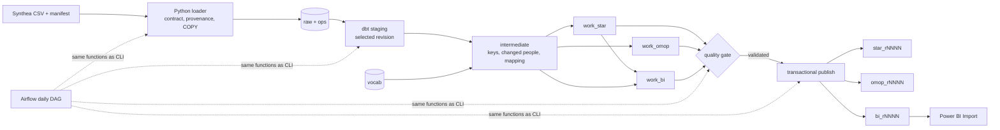

# CohortWarehouse

> **Synthetic data — demonstration only.** No real patient or student records, no clinical decision support,
> no compliance certification.

CohortWarehouse turns Synthea-generated synthetic EHR CSV exports into two analytical products on PostgreSQL:
a **Kimball star schema** for BI and a **scoped OMOP CDM 5.4 mart** for research-style SQL. A Python loader
ingests immutable batches with full reconciliation, dbt builds changed-person incremental candidates, a quality
gate validates them, and a transactional publisher exposes immutable releases to Power BI and OMOP readers.
Airflow schedules the same code the CLI runs.

Specification: [`PRD.md`](PRD.md). Decisions: [`docs/decisions/`](docs/decisions).

## 1. What is implemented (status as of 2026-09-17)

| Area | Status |
|---|---|
| Source contract, manifests, synthetic provenance gate, transactional COPY loader, quarantine, reconciliation | ✅ implemented, tested |
| 25-person edge-case fixture with ordered batches A (baseline) → B (corrections, late arrival, removals) → C (replay) and hand-written expected results | ✅ |
| Persistent key registry, content-based event identity, changed-person incremental slices | ✅ tested (failure/retry, replay, incremental = full rebuild) |
| Star schema: 6 dimensions, 4 facts | ✅ |
| Scoped OMOP 5.4: PERSON, OBSERVATION_PERIOD, VISIT_OCCURRENCE, CONDITION_OCCURRENCE, DRUG_EXPOSURE, MEASUREMENT, OBSERVATION, DEATH, CDM_SOURCE + crosswalk and exclusion ledger | ✅ against the **fictional test vocabulary** |
| Cohorts C1–C3, BI tables, coverage and profile tables | ✅ exact match to independent SQL, OMOP-derived SQL and hand-derived fixture expectations |
| Quality gate (265 dbt tests + 12 Python checks on the fixture), immutable releases, restore, retention | ✅ |
| Least-privilege roles with denial tests | ✅ |
| Airflow 3 DAG + image | ✅ written; DAG structure test runs in CI; **not yet run end-to-end on a live Airflow** |
| GitHub Actions CI | ✅ written; **not yet executed on GitHub** |
| Power BI `.pbix`, screenshots, Performance Analyzer evidence | ⏳ open — measures and contracts are ready (`bi/`, `docs/metric-contracts.md`) |
| 1,000-patient Synthea benchmark, NFR timings, 10 scheduled runs | ⏳ open — `generate` and `benchmark` commands implemented, not executed here (no Java/Synthea jar) |
| Real OHDSI Athena vocabulary validation | ⏳ open — requires Athena access; release profile refuses the fictional vocabulary |

Known limitations are collected in [`docs/omop-scope.md`](docs/omop-scope.md#known-limitations) and the
ADRs. Nothing listed as open above should be presented as complete.

## 2. Architecture



- Schemas: `raw` (immutable batches), `ops` (manifests, registry, runs, quality, releases), `stg`/`int`
  (selected input revision), `work_star`/`work_omop`/`work_bi` (private candidates), `star_rNNNN`/`omop_rNNNN`/
  `bi_rNNNN` (immutable releases), `star`/`omop`/`bi` (stable views → current release), `vocab`.
- Star: `dim_patient`, `dim_date`, `dim_organization`, `dim_encounter_type`, `dim_clinical_code`, `dim_unit`;
  `fct_encounter`, `fct_condition`, `fct_medication`, `fct_observation`. Grains and keys:
  [`dbt/models/marts/star/_star.yml`](dbt/models/marts/star/_star.yml). OMOP entity relationships and scope:
  [`docs/omop-scope.md`](docs/omop-scope.md). Field mapping: [`docs/mapping/source_to_target.csv`](docs/mapping/source_to_target.csv).

## 3. Prerequisites

- Windows 11 with WSL2 + Docker Desktop (≥ 8 GB for containers), or Linux with Docker.
- **At least 30 GB free disk**, as the PRD's reference machine specifies. This is not a nominal figure: the
  1,183-person benchmark (1.35M event rows) plus its releases, WAL and Docker's own disk exhausted a 16 GB
  allowance mid-run, which wedged the Docker daemon. Check free space before a benchmark, and use
  `python -m cohortwarehouse cleanup --dataset-id <id> --apply` to drop superseded releases.
- Python 3.12, Git. Power BI Desktop (Windows) for the report. Java 17+ and the pinned Synthea jar only for
  benchmark generation.
- Pinned versions: PostgreSQL 16.10, dbt-core 1.12.5 / dbt-postgres 1.11.0, Airflow 3.1.0
  ([`requirements/`](requirements)).

## 4. Quick start (fixture, ~10 minutes after downloads)

```powershell
git clone <repo> ; cd CohortWarehouse
python -m venv .venv ; .\.venv\Scripts\Activate.ps1          # Linux: source .venv/bin/activate
pip install -r requirements/dbt.lock -r requirements/dev.lock
Copy-Item .env.example .env                                  # replace every CHANGE_ME
docker compose up -d --wait warehouse
python -m cohortwarehouse doctor
python -m cohortwarehouse bootstrap
python -m cohortwarehouse load-vocabulary tests/fixtures/vocabulary --license-note "fictional test vocabulary"
python -m cohortwarehouse ingest  --manifest tests/fixtures/synthetic_25/batch_A/manifest.json
python -m cohortwarehouse run     --batch-id fixture-A           # prints run_id and quality gate result
python -m cohortwarehouse publish --validated-run <run_id>
python -m cohortwarehouse releases --dataset-id fixture
```
Then continue with `batch_B` and `batch_C` to see incremental corrections and a zero-change replay.

Airflow (optional): `docker compose --profile airflow up -d --build`, UI at http://127.0.0.1:8080, create pool
`cohortwarehouse_warehouse_write` (1 slot), unpause `cohortwarehouse_daily`.

Shut down: `docker compose --profile airflow down` (add `-v` to delete data).

## 5. Data generation

`config/demo.yml` pins Synthea `v3.3.0`, seed `20260915`, Massachusetts, 1,000 requested patients, simulation
end date 2026-06-30. `python -m cohortwarehouse generate --config config/demo.yml` runs the jar and writes a
manifest with generator version, arguments, configuration hash, file hashes and **parsed record counts**.
The actual patient count may differ from the requested population and is recorded, not assumed.

The development fixture (`scripts/build_fixture.py`) deliberately covers the PRD 11.3 edge cases; expected
memberships are written by hand in [`tests/fixtures/synthetic_25/expected.yml`](tests/fixtures/synthetic_25/expected.yml).

## 6. Data models

- **Grains** are declared in every model's YAML (`meta.grain`) and enforced by uniqueness tests.
- **Keys:** integer surrogates from `ops.entity_key_map`; patient and encounter ids are shared by star and OMOP.
  Keyless events use a canonical content fingerprint + occurrence ordinal ([ADR 0002](docs/decisions/0002-key-registry-and-event-identity.md)).
- **SCD:** Type 1 for patient/organization/code/unit/encounter type; Type 0 date. Older releases keep their
  original dimension values.
- **OMOP profile and vocabulary licensing:** [`docs/omop-scope.md`](docs/omop-scope.md),
  [ADR 0006](docs/decisions/0006-vocabulary-boundary-and-minimum-necessary.md).

## 7. Cohort and metric definitions

`D` = manifest as-of date (never `now()`). Eligible = completed-years age ≥ 18 at D, alive at the end of D,
≥ 1 encounter starting in [D−364, D] (UTC dates).

| Cohort | Rule |
|---|---|
| C1 Recorded hypertension | Eligible + SNOMED 59621000 or 38341003 starting on/before D, not stopped before D |
| C2 … with recent systolic > 140 | C1 + latest **valid** LOINC 8480-6 in [D−89, D] (numeric, unit `mm[Hg]`/`mmHg`) strictly > 140; ties broken by greatest stable event key and flagged |
| C3 Frequent recorded encounters | Eligible + ≥ 3 distinct encounters starting in [D−364, D] |

Definitions and code sets are seeds (`dbt/seeds/cohort_*.csv`); thresholds are not in SQL or DAX. These are
demonstration rules, not validated phenotypes. Measures and filter contracts: [`docs/metric-contracts.md`](docs/metric-contracts.md).

## 8. Incremental behaviour

Deliveries are authoritative snapshots: `full` or `scoped` to a declared patient list. Rows absent from a scoped
batch remove those people's events; missing files are errors, never deletions. Per-person fingerprints detect
new/changed/removed people regardless of clinical date (late arrivals included). Changed slices are deleted and
re-inserted transactionally per model. Failed attempts leave people pending for the retry
([ADR 0003](docs/decisions/0003-change-detection-baseline.md)); code, vocabulary, as-of date or reference
changes trigger a full rebuild automatically ([ADR 0004](docs/decisions/0004-incremental-person-slices.md)).

## 9. Operations

Runbooks: [operations](docs/runbooks/operations.md) · [recovery](docs/runbooks/recovery.md) ·
[Power BI refresh](docs/runbooks/power-bi-refresh.md). Publication and restore: [ADR 0005](docs/decisions/0005-publication-and-restore.md).

```text
python -m cohortwarehouse doctor | bootstrap | load-vocabulary | generate | ingest | run [--full-refresh|--validation-only]
                           validate --release | publish --validated-run | restore --release | releases | pin
                           cleanup --dataset-id [--apply] | freshness --dataset-id | benchmark --manifest
```

## 10. Quality and CI

- dbt generic + singular tests run in every build stage and again in the quality gate; results and Python
  checks are recorded in `ops.quality_result`. A skipped blocking check fails the gate.
- Test inventory with honest status: [`docs/test-matrix.md`](docs/test-matrix.md).
- Local: `pytest tests/unit`; with a disposable database: `$env:CW_TEST_DISPOSABLE_DB=1; pytest tests/integration`.
- CI ([`.github/workflows/ci.yml`](.github/workflows/ci.yml)): locks, compose config, ruff, unit tests,
  gitleaks; ephemeral PostgreSQL + bootstrap + lifecycle suite on the **fictional** vocabulary; DAG tests on
  pinned Airflow. CI evidence can never satisfy the real-vocabulary release gate.

## 11. Power BI

Import the nine `bi_*` tables from one immutable `bi_rNNNN` schema selected by the `ReleaseSchema` parameter,
using the read-only BI login. Pages: Cohort discovery, Cohort evidence and utilization, Data trust.
Setup and refresh: [runbook](docs/runbooks/power-bi-refresh.md); measures: [`bi/measures.dax`](bi/measures.dax).

## 12. Benchmarks

Not yet measured. `python -m cohortwarehouse benchmark --manifest <1,000-patient delivery>` records hardware,
versions, row counts, stage timings and raw-load throughput to `artifacts/benchmark/`; results will be summarised
in `docs/benchmark.md` without extrapolation. Fixture-scale observation on a 12-thread laptop with 8 GB for
Docker: a full candidate build + gate takes roughly 1.5–2.5 minutes, dominated by dbt process start-up.

## 13. Governance

Synthetic provenance gate, direct identifiers never loaded, pseudonymous ids, role denial tests, column
denylist, secret scan, licence records and retention policy: [`docs/governance.md`](docs/governance.md).

## 14. Roadmap

P1 after all P0 evidence exists: CARE_SITE/PROVIDER/PROCEDURE_OCCURRENCE, concept ancestors and eras, Type 2
patient geography snapshot, e-mail/Slack alerts, 10,000-patient scale report, Achilles/DQD compatibility
assessment.

## Licence

MIT (see `LICENSE`). Third-party: Synthea (Apache-2.0), OMOP CDM DDL (Apache-2.0). OMOP vocabularies are not
redistributed.
